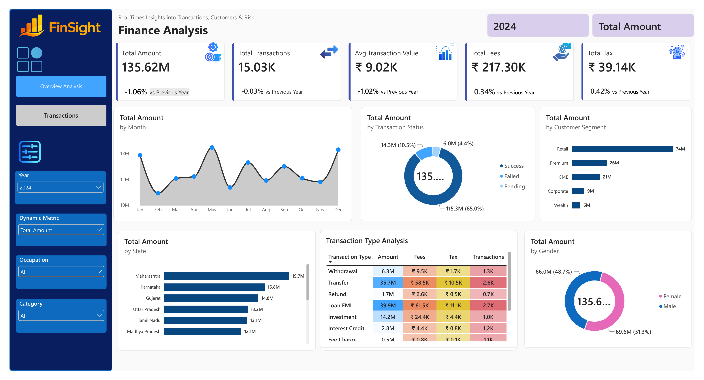
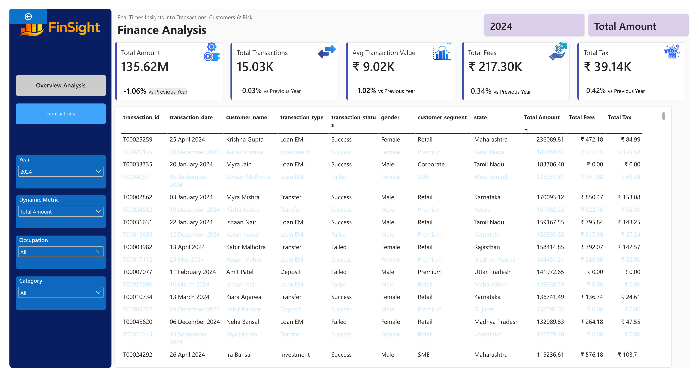

# 📊 Finance Analytics Dashboard | Power BI

An interactive **Finance Analytics Dashboard built with Microsoft Power BI** to analyze financial performance, transaction activity, customer segments, and key financial metrics.

## 📌 Project Overview

This project transforms financial transaction data into an interactive Power BI dashboard that provides both high-level financial insights and detailed transaction-level analysis.

The dashboard allows users to explore financial performance through KPIs, trends, customer segments, transaction statuses, geographic analysis, transaction types, and detailed transaction records.

## 🎯 Objectives

* Analyze overall financial performance
* Track key financial KPIs
* Understand transaction trends
* Analyze customer segments
* Compare transaction statuses
* Analyze financial activity across states
* Examine different transaction types
* Provide detailed transaction-level information
* Present financial data through an interactive dashboard

## 🛠️ Tools & Technologies

* **Microsoft Power BI**
* **DAX**
* **Power Query**
* **Data Visualization**
* **Data Analysis**
* **Business Intelligence**

## 📊 Dashboard Features

### Finance Overview Analysis

The overview page provides key financial metrics including:

* Total Amount
* Total Transactions
* Average Transaction Value
* Total Fees
* Total Tax

It also provides visual analysis of:

* Monthly transaction amounts
* Transaction status
* Customer segments
* State-wise financial activity
* Transaction types
* Gender-wise financial distribution

### Transaction Analysis

The transaction page provides detailed transaction-level information, including:

* Transaction ID
* Transaction Date
* Customer Name
* Transaction Type
* Transaction Status
* Gender
* Customer Segment
* State
* Total Amount
* Total Fees
* Total Tax

## 🖼️ Dashboard Preview

### 📊 Finance Overview Analysis

The overview dashboard provides an interactive view of financial performance through KPI cards and multiple analytical visualizations.

### 📋 Transaction Analysis

The transaction analysis page provides detailed information about individual financial transactions and their associated metrics.

## 📈 Key Metrics

The dashboard provides an overview of:

* **Total Amount:** ₹135.62M
* **Total Transactions:** 15.03K
* **Average Transaction Value:** ₹9.02K
* **Total Fees:** ₹217.30K
* **Total Tax:** ₹39.14K

## 🔍 Skills Demonstrated

This project demonstrates practical experience in:

* Data cleaning and transformation
* Power Query
* DAX calculations
* KPI development
* Interactive dashboard design
* Data visualization
* Financial data analysis
* Business intelligence reporting

## 📁 Project Files

| File | Description |
|---|---|
| `Finance Analytics Dashboard.pbix` | Power BI dashboard project |
| `Finance Analytics Dashboard.pdf` | PDF preview of the dashboard |
| `Finance_Analytics_Dashboard_Page_1.png` | Finance overview dashboard screenshot |
| `Finance_Analytics_Dashboard_Page_2.png` | Transaction analysis screenshot |
## 🚀 How to Use

1. Download the `.pbix` file from this repository.
2. Open it using **Microsoft Power BI Desktop**.
3. Explore the dashboard pages.
4. Use the available filters and interactive elements to analyze the data.

## 📌 Project Purpose

This project was created as part of my **data analytics portfolio** to demonstrate practical skills in Power BI, DAX, data visualization, and financial data analysis.

## 👨‍💻 Author

**Suraj Mali**

GitHub:https://github.com/Suraj-49

---

⭐ If you found this project useful, feel free to star the repository.
